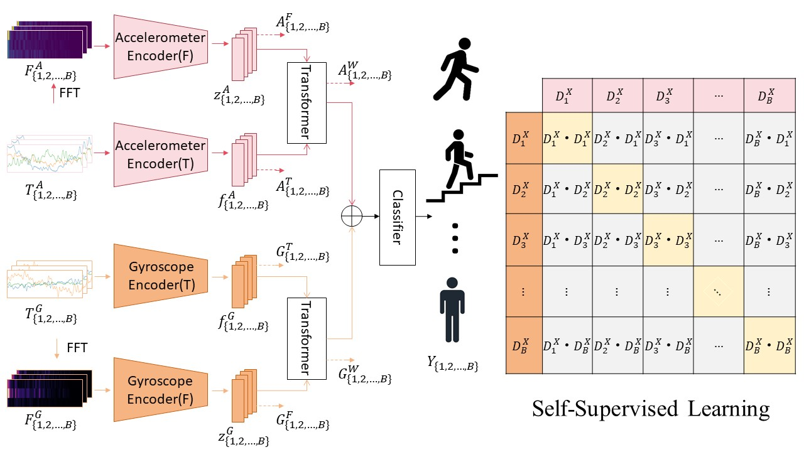

# SSMF

**FreqTime-HAR: Self-Supervised Multimodal Fusion via Transformer for Robust Human Activity Recognition**



## Data Preparation

1. Download datasets ([UCI-HAR](https://archive.ics.uci.edu/ml/datasets/human+activity+recognition+using+smartphones), [mHealth](http://archive.ics.uci.edu/ml/datasets/mhealth+dataset), [PAMAP2](https://archive.ics.uci.edu/ml/datasets/PAMAP2+Physical+Activity+Monitoring)) in `data/`

    `data` \
    `├── UCI HAR Dataset`\
    `├── MHEALTHDATASET`\
    `├── PAMAP2_Dataset`\


1. Create processed data splits for all datasets with 

```
python create_dataset.py
```


## Training

To train self-supervised multimodal fusion (SSMF) network model, run

```
python train_SSMF.py --dataset {Dataset}
```

We also provide baseline models such as DeepConvLSTM (Ordóñez *et al.*, 2016), LSTM-CNN (Xia *et al.*, 2020), and ConvAE (Haresamudram *et al.*, 2019).

```
python train_baseline.py --dataset {Dataset} --model {Model}
```

